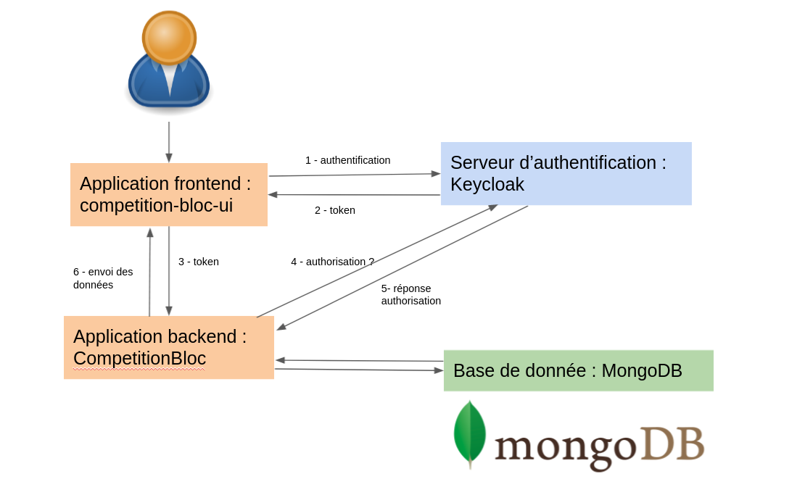

# CompetitionBloc
Projet d'application de gestion des competitions de bloc pour Escapade Club Albi

Cette API est la partie backend, elle est en charge de la gestion des données entre le frontend dont le code est accessible [ici](https://github.com/MGeraud/competition-bloc-ui) .

L'architecture du projet complet se compose :
1. d'une application frontend ReactJS dont le lien est ci-dessus (réservée à l'association Escapade Club Albi)
2. de cette application backend Java situé située dans le dossier "competitionbloc"
3. un serveur Keycloak standalone pour les authentifications
4. un base de donnée MongoDB

Pour déployer ce système informatique de gestion des compétitions de blocs qui est open-source, il vous faudra :

1. Déployer un serveur Keycloak. [information ici](https://www.keycloak.org/docs/latest/server_installation/index.html)
2. Attribuer les roles "juge" et "gestion", créer les clients CompetitionBloc (type Bearer) et competition-bloc-ui (type public)
3. Créer les utilisateurs pour le client competition-bloc-ui et leur attribuer leurs roles (juge ou gestion ou les 2)
4. Déployer une base de donnée MongoDb, celle présente via image docker dans ce dépot est destinée aux tests. Je vous conseille un déploiement via [MongoDB Atlas](https://www.mongodb.com/cloud/atlas/lp/try2-hterms?utm_content=controlhterms&utm_source=google&utm_campaign=gs_emea_france_search_core_brand_atlas_desktop&utm_term=mongodb&utm_medium=cpc_paid_search&utm_ad=e&utm_ad_campaign_id=12212624521&gclid=Cj0KCQjwpf2IBhDkARIsAGVo0D3sSiKqQ4o6xuDYSSOS9xmh1YwexjDMyE0UUaSj-QJIuKy75LmwYV8aAuw3EALw_wcB)
5. Modifier le fichier application.properties de ce dépôt avec l'uri fournie par votre serveur keycloak et insérer les propriétés pour l'accès à votre base de données fourni par MongoDB Atlas
6. Créer votre propre frontend, ou utiliser celui de l'association Escapade Club Albi à condition de veiller à retirer leur logo (dans ce cas , modifier les urls du serveurs keycloak et de l'api backend si elles ne sont pas déployées en local sur le même serveur)

